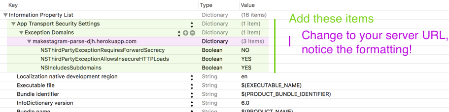

In this page we will add a new feature that allows users to find & follow friends. We will start by setting up the UI in Interface Builder, then we'll fill in the implementation in code.

**The explanations and instructions in this step will not be as detailed as in the previous ones - the view controller we are about to build behaves very similar to the main view controller in the notes app. Therefore it won't be necessary to discuss all of the involved concepts.**

If you are incorporating any kind of search into your app, the code in this step should serve as a very good template!

#Setting up the Friend Search UI

This is what the final UI will look like, once the search functionality is complete:


At the root level we only have two components: a search Bar and a table view.

##Adding a Search Bar

> [action]
> Add a search bar to the `FriendSearchViewController` as shown in the video below:
> <video width="100%" height="400pt" controls>
  <source src="https://s3.amazonaws.com/mgwu-misc/SA2015/SearchBarConstraints_small.mov" type="video/mp4">
>
> Remember that the last step is to use the shortkey _⌘⌥=_ to update the frame according to its new constraints. Do this each time you finish adding a component in the steps below.

##Adding a Table View

> [action]
> Add a table view to the `FriendSearchViewController` as shown in the video below:
> <video width="100%" height="400pt" controls>
  <source src="https://s3.amazonaws.com/mgwu-misc/SA2015/FriendSearchTableViewConstraints_small.mov" type="video/mp4">

##Adding a Custom Table View Cell

> [action]
> Add a table view cell to the `FriendSearchViewController` as shown in the video below:
> <video width="100%" height="400pt" controls>
  <source src="https://s3.amazonaws.com/mgwu-misc/SA2015/CustomCellFriendSearch_small.mov" type="video/mp4">

#Creating Code Connections

We'll need multiple code connections to generate the cells from code and to implement the _follow_ button. We'll also need code connections for the search bar.

##Cell identifier

Let's start by setting up an identifier for our new table view cell.

> [action]
> Set the identifier for the `FriendSearchViewController`'s table view cell to _UserCell_:
> 

##Custom Cell Class

Next, create a new class for this cell.

> [action]
> Create a new `UITableViewCell` subclass called `FriendSearchTableViewCell` and add it to the _View_ group as shown below. Remember to first add a folder on the filesystem, then add that folder to Xcode. That way groups and folders stay in sync:
> 

##Referencing Outlets and Button Callback

Then connect the new class to the table view cell.

> [action]
> Set the custom class of the table view cell to `FriendSearchTableViewCell`:
> 

Next, set up referencing outlets for the label and the button on the table view cell. Also, add a callback for button taps:
> [action]
> Create the three code connections outlined below with the `FriendSearchTableViewCell`:
> 

##Table View Data Source

Now, set the table view's data source to be the `FriendSearchViewController`.

> [action]
> Set the Table View Data Source as as shown below:
> 

##Referencing Outlets for FriendSearchViewController

Next, set up referencing outlets to the `FriendSearchViewController` from the table view and the search bar.

> [action]
> Set up the following referencing outlets:
> 

##Search Bar Delegate

Finally, set the delegate of the `UISearchBarDelegate` protocol to be the `FriendSearchViewController`.

> [action]
> Set up the search bar delegate as shown below:
> 

#Adding the Friend Search Code

As discussed at the beginning of this step, we won't discuss the code in detail. The source code has comments in all the relevant places. We will provide you with the full source code that you need for each class - you should take time to read through it and make sure that you understand it. We'll then discuss a few interesting, high-level details about the solution.

##Addding Parse Requests

First we are going to add 5 different Parse requests.

> [action]
> Add the following methods to the `ParseHelper` class:
>
     // MARK: Following
>    
    /**
     Fetches all users that the provided user is following.
>     
     :param: user The user whose followees you want to retrieve
     :param: completionBlock The completion block that is called when the query completes
     */
    static func getFollowingUsersForUser(user: PFUser, completionBlock: PFQueryArrayResultBlock) {
        let query = PFQuery(className: ParseFollowClass)
>        
        query.whereKey(ParseFollowFromUser, equalTo:user)
        query.findObjectsInBackgroundWithBlock(completionBlock)
    }
>    
    /**
     Establishes a follow relationship between two users.
>     
     :param: user    The user that is following
     :param: toUser  The user that is being followed
     */
    static func addFollowRelationshipFromUser(user: PFUser, toUser: PFUser) {
        let followObject = PFObject(className: ParseFollowClass)
        followObject.setObject(user, forKey: ParseFollowFromUser)
        followObject.setObject(toUser, forKey: ParseFollowToUser)
>        
        followObject.saveInBackgroundWithBlock(nil)
    }
>    
    /**
     Deletes a follow relationship between two users.
>     
     :param: user    The user that is following
     :param: toUser  The user that is being followed
     */
    static func removeFollowRelationshipFromUser(user: PFUser, toUser: PFUser) {
        let query = PFQuery(className: ParseFollowClass)
        query.whereKey(ParseFollowFromUser, equalTo:user)
        query.whereKey(ParseFollowToUser, equalTo: toUser)
>        
        query.findObjectsInBackgroundWithBlock { (results: [PFObject]?, error: NSError?) -> Void in
>            
            let results = results ?? []
>            
            for follow in results {
                follow.deleteInBackgroundWithBlock(nil)
            }
        }
    }
>    
    // MARK: Users
>    
    /**
     Fetch all users, except the one that's currently signed in.
     Limits the amount of users returned to 20.
>     
     :param: completionBlock The completion block that is called when the query completes
>     
     :returns: The generated PFQuery
     */
    static func allUsers(completionBlock: PFQueryArrayResultBlock) -> PFQuery {
        let query = PFUser.query()!
        // exclude the current user
        query.whereKey(ParseHelper.ParseUserUsername,
                       notEqualTo: PFUser.currentUser()!.username!)
        query.orderByAscending(ParseHelper.ParseUserUsername)
        query.limit = 20
>        
        query.findObjectsInBackgroundWithBlock(completionBlock)
>        
        return query
    }
>    
    /**
     Fetch users whose usernames match the provided search term.
>     
     :param: searchText The text that should be used to search for users
     :param: completionBlock The completion block that is called when the query completes
>     
     :returns: The generated PFQuery
     */
    static func searchUsers(searchText: String, completionBlock: PFQueryArrayResultBlock) -> PFQuery {
            /*
             NOTE: We are using a Regex to allow for a case insensitive compare of usernames.
             Regex can be slow on large datasets. For large amount of data it's better to store
             lowercased username in a separate column and perform a regular string compare.
             */
            let query = PFUser.query()!.whereKey(ParseHelper.ParseUserUsername,
                                                 matchesRegex: searchText, modifiers: "i")
>            
            query.whereKey(ParseHelper.ParseUserUsername,
                           notEqualTo: PFUser.currentUser()!.username!)
>            
            query.orderByAscending(ParseHelper.ParseUserUsername)
            query.limit = 20
>            
            query.findObjectsInBackgroundWithBlock(completionBlock)
>            
            return query
    }


We've added a total of 5 different queries. All of these queries will be used by the `FriendSearchViewController`.

Two queries are used to search for users. `allUsers(completionBlock:)` returns all users (except the signed in one) - this query is for when the search bar in the `FriendSearchViewController` is empty.

`searchUsers(searchText:completionBlock:)` takes the current search `String` and returns any users that match it.

It's noteworthy that both of these methods return a `PFQuery` object. This allows the `FriendSearchViewController` to keep a reference to current active request. As the user types into the search field, we will kick off a new search request every time the text changes; you will see that later in the code for the `FriendSearchViewController`. The `FriendSearchViewController` will use the reference to the current query to cancel the current request before starting a new one. That way we can prevent a fast-typing user from starting many requests to start in parallel.

The other three methods are used to add, remove and retrieve followees of the current user. These are pretty standard Parse queries without any noteworthy implementation details.

Using these 5 queries, the `FriendSearchViewController` will be able to display users that we are searching for _and_ to display whether or not we are following them.

##Implementing the FriendSearchTableViewCell

Next, let's discuss the implementation of the `FriendSearchTableViewCell`. The main features of the cell are to display a username and a _follow_ button. The follow button will indicate whether or not we are already following a user.

When the follow button is tapped, we want Makestagram to follow or unfollow the user. However, we won't implement that directly in the `FriendSearchTableViewCell`. Typically we want to keep more complex functionality outside of our views. Our solution is to define a `delegate` that will be responsible for performing the follow / unfollow.

The `delegate` of each cell will be the `FriendSearchViewController`. When the follow button is tapped, the `FriendTableViewCell` will inform the `FriendSearchViewController` so that it can handle actually making the follow happen.

> [action]
> Replace the contents of _FriendSearchTableViewCell.swift_ with the following one:
>
    import UIKit
    import Parse
>
    protocol FriendSearchTableViewCellDelegate: class {
        func cell(cell: FriendSearchTableViewCell, didSelectFollowUser user: PFUser)
        func cell(cell: FriendSearchTableViewCell, didSelectUnfollowUser user: PFUser)
    }
>
    class FriendSearchTableViewCell: UITableViewCell {
>
        @IBOutlet weak var usernameLabel: UILabel!
        @IBOutlet weak var followButton: UIButton!
        weak var delegate: FriendSearchTableViewCellDelegate?
>
        var user: PFUser? {
            didSet {
                usernameLabel.text = user?.username
            }
        }
>
        var canFollow: Bool? = true {
            didSet {
                /*
                  Change the state of the follow button based on whether or not
                  it is possible to follow a user.
                */
                if let canFollow = canFollow {
                    followButton.selected = !canFollow
                }
            }
        }
>
        @IBAction func followButtonTapped(sender: AnyObject) {
            if let canFollow = canFollow where canFollow == true {
                delegate?.cell(self, didSelectFollowUser: user!)
                self.canFollow = false
            } else {
                delegate?.cell(self, didSelectUnfollowUser: user!)
                self.canFollow = true
            }
        }
    }

Here we can see that we defined the `FriendSearchTableViewCellDelegate` protocol. Any class that wants to be a delegate of the `FriendSearchTableViewCell` will have to implement that protocol. Notice that the delegate methods are simply used to inform the delegate of whether a user was selected as followed or not. 

Notice also that we have a property for the delegate:

 	weak var delegate: FriendSearchTableViewCellDelegate? 
 	
So as each `FriendSearchTableViewCell` is created, the `FriendSearchViewController` will set itself as the delegate by assigning itself with this `delegate` property.

After you take a detailed look at the code, we can move on to the core component: the `FriendSearchViewController`.


##Implementing the FriendSearchViewController

The `FriendSearchViewController` will feel somewhat similar to the main View Controller in _Make School Notes_ because they're both controlling table views. It will have two different states: searching or not searching. Based on that state it calls one of the two different Parse queries that we defined earlier.

The biggest novelty in the `FriendSearchViewController` is the concept of a local cache. We will create a special property called `followingUsers` that stores which users the current user is following. When one of the `FriendSearchTableViewCell`s triggers a unfollow / follow, we send a request to Parse, **but** we also update the `followingUsers` property right away. As you will see in the code, this allows us to update the UI immediately, without having to wait for the server to respond.

> [action]
> Replace the content of _FriendSearchViewController.swift_ with the following code:
>
	import UIKit
	import Parse
>	
	class FriendSearchViewController: UIViewController {
>	    
	    @IBOutlet weak var searchBar: UISearchBar!
	    @IBOutlet weak var tableView: UITableView!
>	    
	    // stores all the users that match the current search query
	    var users: [PFUser]?
>	    
	    /*
	     This is a local cache. It stores all the users this user is following.
	     It is used to update the UI immediately upon user interaction, instead of
	     having to wait for a server response.
	     */
	    var followingUsers: [PFUser]? {
	        didSet {
	            /**
	             the list of following users may be fetched after the tableView has displayed
	             cells. In this case, we reload the data to reflect "following" status
	             */
	            tableView.reloadData()
	        }
	    }
>	    
	    // the current parse query
	    var query: PFQuery? {
	        didSet {
	            // whenever we assign a new query, cancel any previous requests
	            // you can use oldValue to access the previous value of the property
	            oldValue?.cancel()
	        }
	    }
>	    
	    // this view can be in two different states
	    enum State {
	        case DefaultMode
	        case SearchMode
	    }
>	    
	    // whenever the state changes, perform one of the two queries and update the list
	    var state: State = .DefaultMode {
	        didSet {
	            switch (state) {
	            case .DefaultMode:
	                query = ParseHelper.allUsers(updateList)
>	                
	            case .SearchMode:
	                let searchText = searchBar?.text ?? ""
	                query = ParseHelper.searchUsers(searchText, completionBlock:updateList)
	            }
	        }
	    }
>	    
	    // MARK: Update userlist
>	    
	    /**
	     Is called as the completion block of all queries.
	     As soon as a query completes, this method updates the Table View.
	     */
	    func updateList(results: [PFObject]?, error: NSError?) {
	        self.users = results as? [PFUser] ?? []
	        self.tableView.reloadData()
>	        
	    }
>	    
	    // MARK: View Lifecycle
>	    
	    override func viewWillAppear(animated: Bool) {
	        super.viewWillAppear(animated)
>	        
	        state = .DefaultMode
>	        
	        // fill the cache of a user's followees
	        ParseHelper.getFollowingUsersForUser(PFUser.currentUser()!) { (results: [PFObject]?, error: NSError?) -> Void in
	            let relations = results ?? []
	            // use map to extract the User from a Follow object
	            self.followingUsers = relations.map {
	                $0.objectForKey(ParseHelper.ParseFollowToUser) as! PFUser
	            }
>	            
	        }
	    }
>	    
	}
>	
	// MARK: TableView Data Source
>	
	extension FriendSearchViewController: UITableViewDataSource {
>	    
	    func tableView(tableView: UITableView, numberOfRowsInSection section: Int) -> Int {
	        return self.users?.count ?? 0
	    }
>	    
	    func tableView(tableView: UITableView, cellForRowAtIndexPath indexPath: NSIndexPath) -> UITableViewCell {
	        let cell = tableView.dequeueReusableCellWithIdentifier("UserCell") as! FriendSearchTableViewCell
>	        
	        let user = users![indexPath.row]
	        cell.user = user
>	        
	        if let followingUsers = followingUsers {
	            // check if current user is already following displayed user
	            // change button appereance based on result
	            cell.canFollow = !followingUsers.contains(user)
	        }
>	        
	        cell.delegate = self
>	        
	        return cell
	    }
	}
>	
	// MARK: Searchbar Delegate
>	
	extension FriendSearchViewController: UISearchBarDelegate {
>	    
	    func searchBarTextDidBeginEditing(searchBar: UISearchBar) {
	        searchBar.setShowsCancelButton(true, animated: true)
	        state = .SearchMode
	    }
>	    
	    func searchBarCancelButtonClicked(searchBar: UISearchBar) {
	        searchBar.resignFirstResponder()
	        searchBar.text = ""
	        searchBar.setShowsCancelButton(false, animated: true)
	        state = .DefaultMode
	    }
>	    
	    func searchBar(searchBar: UISearchBar, textDidChange searchText: String) {
	        ParseHelper.searchUsers(searchText, completionBlock:updateList)
	    }
>	    
	}
>	
	// MARK: FriendSearchTableViewCell Delegate
>	
	extension FriendSearchViewController: FriendSearchTableViewCellDelegate {
>	    
	    func cell(cell: FriendSearchTableViewCell, didSelectFollowUser user: PFUser) {
	        ParseHelper.addFollowRelationshipFromUser(PFUser.currentUser()!, toUser: user)
	        // update local cache
	        followingUsers?.append(user)
	    }
>	    
	    func cell(cell: FriendSearchTableViewCell, didSelectUnfollowUser user: PFUser) {
	        if let followingUsers = followingUsers {
>	            ParseHelper.removeFollowRelationshipFromUser(PFUser.currentUser()!, toUser: user)
	            // update local cache
	            self.followingUsers = followingUsers.filter({$0 != user})
	        }
	    }
>	    
	}
	

Take your time to read through this implementation and the comments in the source code. There's a lot going on here! The implementation of the `FriendSearchViewController` completes the Friend Search feature.

Once you are done you can move on to the next step: importing test data.

#Getting Additional Users into Makestagram

To test all of this new functionality we need multiple users with multiple posts stored on our server. There are two ways you can accomplish this:

1. Create new users in the Parse Data Browser, then log in with these users and create posts.
2. Use our *Parse-Seeder* project to populate your app with some fake users and cat pictures!

You can download the Parse-Seeder project [here](https://github.com/MakeSchool-Tutorials/Makestagram-Swift-Parse-Seeder/archive/master.zip).

> [action]
> 
> 1. Unzip the Parse-Seeder project that you downloaded
> 1. Open MakestagramParseSeeder.xcworkspace
> 1. Update the *Configuration.swift* file with the `applicationID` and `serverURL` from your Makestragram `AppDelegate` Parse configuration.
> 1. Run the project and (hopefully) success!
>
> Note: The Parse-Seeder project is a quick utility script that will only be used by us, and not shipped to our users. As a result, it has some examples of breaking our _best practices_ we have discussed. In particular, it makes some synchronous calls to save things to the Parse server, which is something that should be avoided in your app whenever possible.

Now you should be able to try out the follow feature. Follow another user, then refresh the timelime:


You should see our posts show up on the timeline! This is very exciting. Now you can use the app with multiple users!

> [info]
> You may find that your app isn't loading any images for the posts you just imported. You might see an error message in your console that looks like this:
> 
> ```
> 2016-06-26 13:52:37.811 Makestagram[34589:6243499] [Error]: The resource could not be loaded because the App Transport Security policy requires the use of a secure connection. (Code: 100, Version: 1.13.0)
> ```
> 
> This is because of a new security feature introduced in iOS 9 called *App Transport Security*. Apple strongly prefers that all data retreived by an application from the internet is sent over HTTPS, which is like HTTP, except encrypted. This prevents computers on the route between your phone and the data server from listening in on the transmission, which is commonly called a [Man-in-the-middle attack](https://en.wikipedia.org/wiki/Man-in-the-middle_attack). 
>
> The way our Parse server is configured, it serves most data over HTTPS, which is great. However, it serves large files (like our image files) over HTTP for better speed. 
> 
> To fix this issue, you can modify your *Info.plist* to allow loading data over HTTP from your Parse server. The Info.plist stores configuration data for our app; you can find it under the *Supporting Files* group in your project.
> 
> Change your Info.plist to look like this. Be very careful that you write everything exactly the same, or it won't work! Make sure to change the server url to one that matches your server. You can find your server url by looking in your AppDelegate.swift.
> 
> 
> 
> You may need to clean your project (*Product -> Clean*) after any changes to the Info.plist to make sure they're reflected in the app on device or simulator.

#Conclusion

This step serveed as a nice template for implementing a search using Parse. Hopefully this made you more comfortable working with Interface Builder and building view controllers from scratch!

In the next step we will discuss how to add a signup and login screen to _Makestagram_!
