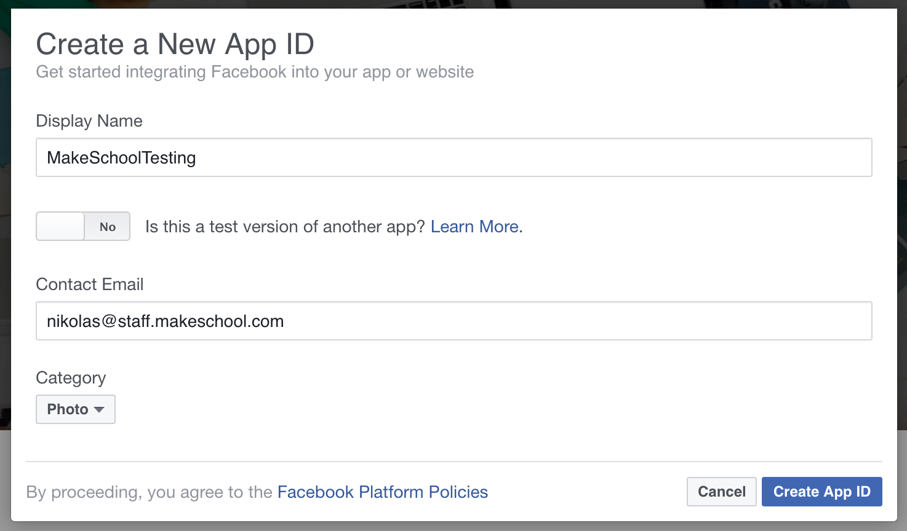
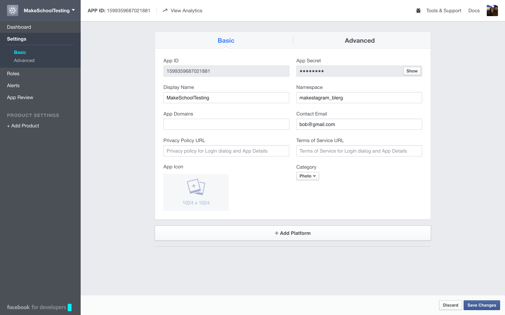
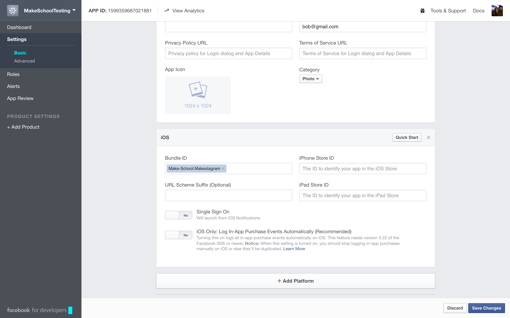
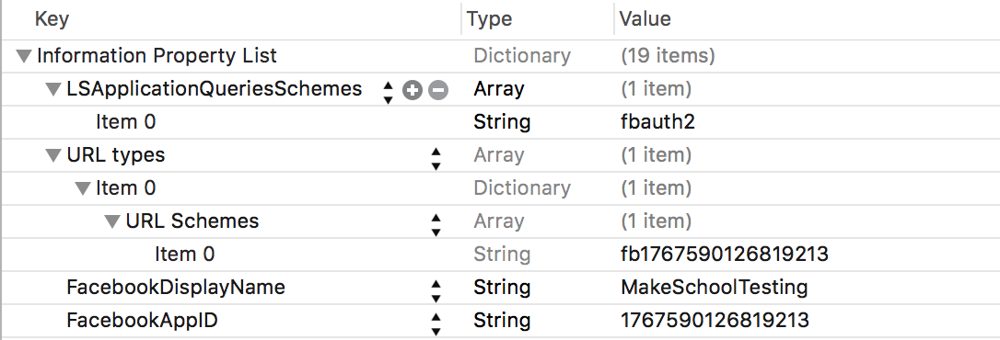
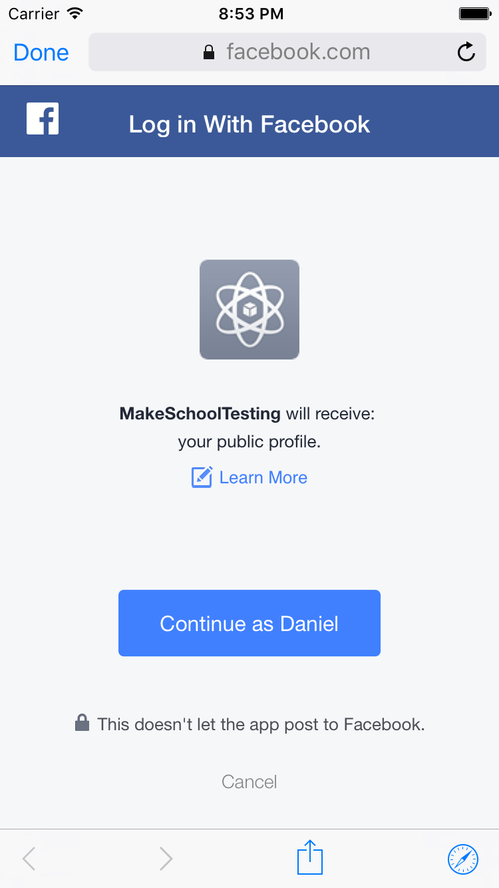

So far we have been using a placeholder login mechanism. In this step we will replace it with a real login and signup screen. Parse makes it fairly easy to create a login screen by providing a default UI component that we can use in our app.

Signing up with an email address and a password is a standard feature that we'll provide; but it's a pretty old school way of joining a new app! We'll provide our users with a Facebook login option as well. This is a great way to take some friction out of the signup process.

Since this step will contain a few new concepts, we will discuss it in more detail than the previous step. You'll get a refresher on how to change the initial view controller of your app and also how to configure **Makestagram** as a Facebook compatible application.

#Changing the Screen Flow

One of the first things we need to do is to change the screen flow of our app. Currently the `TabBarViewController` is the main View Controller and gets presented as soon as the app starts.

Our new screen flow will depend on whether or not the user is currently signed in. If the user is already signed in, we want to display the `TabBarViewController`; if no user is signed in we want to display the login / signup screen.

This will require some changes to our project settings. We can no longer simply display our main storyboard on launch, instead we need to write code that determines what the first view controller in our app should be.

Let's start by changing a setting in the _Info.plist_ that currently defines that the app should always start by displaying the _Main.storyboard_.

> [action]
Remove the _Main storyboard file base name_ entry from the apps _Info.plist_, by selecting it as shown in the image below, and hitting the delete key:

This entry defines which storyboard should be loaded and displayed upon app start. By removing it, we have the opportunity to define the initial view controller in code. You'll see how this works in just a second!

#Providing the Initial View Controller with an Identifier

In order to write code to decide which view controller should be displayed first, we will need a way to reference that specific view controller. For that purpose, Interface Builder provides each view controller with a _Storyboard ID_. By default that ID is empty. If we want to reference a specific view controller in code, we need to choose a _Storyboard ID_. For **Makestagram**, we want to display the `TabBarViewController` once a user is logged in.

Let's provide a Storyboard ID for that controller.

> [action]
> Set the Storyboard ID for the _TabBarController_ to: _TabBarController_:
>

In many ways programming is a creative pursuit; however, when it comes to naming things, you're mostly better off making the obvious yet boring choice.

We're done with preparing our configuration, we can now get down to coding!

#Adding the Code

You've heard this question before: where should we place code that runs when our app starts?
> [solution]
**Correct:** in the `AppDelegate`. The `AppDelegate` is the class that is mainly responsible for communicating with the iOS operating system; it is also the class that receives a message when your app has launched. That's where we need to decide whether or not we want to confront our users with a login screen.

Our very first step will be deleting our existing login functionality. Soon we will have a real login screen, so we no longer need the placeholder code.

> [action]
> Delete the following lines from the `application(_:, didFinishLaunchingWithOptions:)` method in the `AppDelegate`:
>
    do {
        try PFUser.logInWithUsername("test", password: "test")
    } catch {
        print("Unable to log in")
    }
>
    if let currentUser = PFUser.currentUser() {
        print("\(currentUser.username!) logged in successfully")
    } else {
        print("No logged in user :(")
    }

Now, let's start with the implementation of our new login mechanism by getting a dull task done: importing some modules.

> [action]
> Add the following import statements to _AppDelegate.swift_:
>
    import FBSDKCoreKit
    import ParseUI
    import ParseFacebookUtilsV4

Another thing that we should get out of the way is the boilerplate code that the Facebook SDK requires. There's nothing interesting about it; it just needs to be there to make things work.

> [action]
> Add the following two methods to the `AppDelegate` class and remove the existing implementation of `applicationDidBecomeActive`:
>
    //MARK: Facebook Integration
>
    func applicationDidBecomeActive(application: UIApplication) {
        FBSDKAppEvents.activateApp()
    }
>
    func application(application: UIApplication, openURL url: NSURL, sourceApplication: String?, annotation: AnyObject) -> Bool {
        return FBSDKApplicationDelegate.sharedInstance().application(application, openURL: url, sourceApplication: sourceApplication, annotation: annotation)
    }

Now we can finally get down to the actual login code. We're going to use a helper class which will make using the Parse login functionality even easier. It is called `ParseLoginHelper`. It's already in your project! 

> [action]
> Open *ParseLoginHelper.swift*. It's in the Helpers group.

Look at the `init` method. We will initialize `ParseLoginHelper` with a `ParseLoginHelperCallback` closure which has two parameters: a `user` and an `error`.

The closure we will provide when initializing the `ParseLoginHelper` will be called once the user has tapped the login button and the server has responded with either a success or failure message. We'll then either receive an `error` or a `user`, which will allow us to determine if the login was successful.

Let's create an instance of `ParseLoginHelper`.

> [action]
> Add the following property and initializer to your `AppDelegate`:
>
    var parseLoginHelper: ParseLoginHelper!
>    
    override init() {
        super.init()
>        
        parseLoginHelper = ParseLoginHelper {[unowned self] user, error in
            // Initialize the ParseLoginHelper with a callback
            if let error = error {
                // 1
                ErrorHandling.defaultErrorHandler(error)
            } else  if let _ = user {
                // if login was successful, display the TabBarController
                // 2
                let storyboard = UIStoryboard(name: "Main", bundle: nil)
                let tabBarController = storyboard.instantiateViewControllerWithIdentifier("TabBarController")
                // 3
>                self.window?.rootViewController!.presentViewController(tabBarController, animated:true, completion:nil)
            }
        }
    }

1. In case we receive an `error` in our closure, we call the `ErrorHandling.defaultErrorHandler` method. This error handler method was included as part of the template project. It displays a popup with the error message. We'll discuss error handling in more detail later.

2. If we didn't receive an `error`, but instead received a `user`, we know that our log in was successful. In this case, we load Main.storyboard and create the TabBarController. This is the line in which we use the Storyboard ID that we set up earlier. Before we removed Main.storyboard as the default entry point to our app, all of this was magically happening under the hood. Now we have to load storyboards and view controllers manually.

3. After we have loaded the view controller, we are also responsible for presenting it. We can choose the main view controller of our app, in code, by setting the `rootViewController` property of the `AppDelegate`'s `window`. When the code in this closure runs, our app will already have the login screen as its `rootViewController`. As soon as the successful login completes, we present the TabBarController on top of the login screen.

> [info]
> If the whole `[unowned self]` thing in there is making you curious to the point of crazy, you can read more about it [here](http://stackoverflow.com/questions/24320347/shall-we-always-use-unowned-self-inside-closure-in-swift). Be careful though, because you'll be opening a big can of worms involving memory management in Swift!

Now we have some code in place that will run after a user has attempted to log in - but where's the code that presents the login screen in the first place? We'll take care of that now.

We'll extend the `application(_:didFinishLaunchingWithOptions:)` method to decide which view controller should be the `rootViewController` of our app.

> [action]
>
> Add the following code right before the `return true` line in  `application(_:didFinishLaunchingWithOptions:)` method:
>
    // Initialize Facebook
    // 1
    PFFacebookUtils.initializeFacebookWithApplicationLaunchOptions(launchOptions)
>    
    // check if we have logged in user
    // 2
    let user = PFUser.currentUser()
>    
    let startViewController: UIViewController
>    
    if (user != nil) {
        // 3
        // if we have a user, set the TabBarController to be the initial view controller
        let storyboard = UIStoryboard(name: "Main", bundle: nil)
        startViewController = storyboard.instantiateViewControllerWithIdentifier("TabBarController") as! UITabBarController
    } else {
        // 4
        // Otherwise set the LoginViewController to be the first
        let loginViewController = PFLogInViewController()
        loginViewController.fields = [.UsernameAndPassword, .LogInButton, .SignUpButton, .PasswordForgotten, .Facebook]
        loginViewController.delegate = parseLoginHelper
        loginViewController.signUpController?.delegate = parseLoginHelper
>        
        startViewController = loginViewController
    }
>    
    // 5
    self.window = UIWindow(frame: UIScreen.mainScreen().bounds)
    self.window?.rootViewController = startViewController;
    self.window?.makeKeyAndVisible()

1. We start of by initializing the `PFFacebookUtils` - this is boilerplate code once again.

2. We check whether or not a user is currently logged in.

3. If a user is logged in, we load the _TabBarControlller_, just as we did in the closure of the `ParseLoginHelper`, and let the user jump directly to the timeline.

4. If we don't have a user, we need to present the Login View Controller. We create one, using the `PFLoginViewController` provided by Parse. The component allows for some customization, you can read the details [here](https://parseplatform.github.io/Parse-SDK-iOS-OSX/api/Classes/PFLogInViewController.html). We also set the `parseLoginHelper` as the `delegate` of the `PFLoginViewController`. The `ParseLoginHelper` will be notified about logins and signups by the `PFLoginViewController`. It will then forward the information to us by calling the closure that we defined when creating the `ParseLoginHelper`.

5. The last step is creating the `UIWindow` for our application. That's the container for all the views in our app. We then display the `startViewController` as the `rootViewController` of the app. Depending on whether we had a logged in user or not, this will be the `TabBarViewController` or the `PFLoginViewController`.

Awesome! Our login code is almost in place. There's one last change the Facebook SDK requires from us.

> [action]
> Replace the existing return statement in `application(_:didFinishLaunchingWithOptions:)` with this one:
>
    return FBSDKApplicationDelegate.sharedInstance().application(application, didFinishLaunchingWithOptions: launchOptions)

Once again a boilerplate code requirement by the Facebook SDK that we don't need to discuss in detail.

Now it's time to try this new code out in action! First we need to delete the **Makestagram** app from the simulator to destroy our session. Otherwise Parse would remember that we're logged in and won't show us the login screen.

> [action]
> Delete the _Makestagram_ app from the Simulator:
> <video width="100%" height="400pt" controls>
  <source src="https://s3.amazonaws.com/mgwu-misc/SA2015/DeleteApp_small.mov" type="video/mp4">

Now you can run the app again and it will be installed as if just downloaded from the App Store. When the app starts, you should see the login screen appear:

When you enter the credentials for the test user (username: _test_, password: _test_), you should be successfully logged in and see the timeline show up!

Awesome! Our login feature is almost complete! Except for one thing: when you tap the _Log In with Facebook_ button your app will crash.

We'll tackle that issue next.

#Making the Facebook Login Work

In order to be able to log in with Facebook, we first need to register our app with their platform. Make sure you are signed up and logged in to Facebook so that you are able to access the Facebook Developer Portal. For future reference you can find the general set up guide [here](https://developers.facebook.com/docs/ios/getting-started). For now it will be easier to follow these instructions, which are more specific to Makestagram.

Let's create a new Facebook app.

> [action]
> Open the Developer Portal with [this link](https://developers.facebook.com/?advanced_app_create=true). You should see a popup that asks you for information about your app. Fill it out as shown below, replacing the Contact Email with your own.

<!-- html comment to break boxes -->

> [info]
> "Makestagram" as a display name won't work, because:
> Certain terms like "gram" are not allowed. For example, you may not use our trademarks or brand elements (including FB, Face, Book, Insta, Gram, and Rift) or any confusingly similar terms in your app name if such term is, or could be perceived as, a reference to Facebook or its brands.

After you have provided the necessary information you will be redirected to your app's dashboard. We've set up a basic app, but Facebook still needs to know which platforms our app will support. For each platform (iOS, Android, Web, etc.) Facebook requires some specific information.

Let's tell Facebook that we're building an iOS app.

> [action]
> Switch to the _Settings_ page and select the _Add Platform_ button:

Select iOS in the modal:

Great! Now we need to configure a property of the iOS platform that we just added: the _bundle identifier_. The bundle identifier is a (hopefully) unique identifier for your app. The Facebook SDK will use this identifier to ensure that only your iOS app will work with the app we just created on Facebook.

First you should change your bundle identifier so it's unique.

> [action]
> Find your bundle identifier as shown below:

Change your bundle identifier to look something like this:
`com.firstnamelastname.Makestagram` where `firstname` and `lastname` are your first and last name. If you own any domain names, you can use one of those instead of `com.firstnamelastname`.

<!-- html comment to break boxes -->

> [action]
> Copy your bundle identifier and add it to your Facebook app as shown in this image:

>
Don't forget to click the *Save Changes* button in the bottom-right hand corner!

Before we can test Facebook log in we'll need to make some changes to the _Info.plist_. The Info.plist is the main configuration file for every app.

> [action]
Open your app's Info.plist. You can find it in the *Supporting Files* group. Configure it by performing the following steps from Facebook's Quick Start guide (_Note that you can add new lines to a .plist by selecting an existing line and hitting the + button._). If you find these directions hard to follow, take a look at the image below:
>
1. Create a key called _FacebookAppID_ with a string value. Copy and paste your App ID from the Facebook for Developers page. It should look something like `148093482498230`, but your numbers will be different.
>
2. Create a key called _FacebookDisplayName_, also with a string value. Copy and paste the Display Name you configured from the Facebook for Developers page.
>
3. Create a key called _URL types_, it should have an array value. Expand the URL types dropdown by clicking the arrow to the left of the name. It should have an item called "Item 0". Expand that item too. You should find an item called *URL identifier*. Change URL identifier to *URL Schemes*. URL Schemes should have an array value. Expand the URL Schemes item, you should see an *Item 0* of type *String*. The value of that Item 0 should be your App ID prefixed with `fb`. For example, it might look like `fb148093482498230`, though your numbers will be different.
>
4. Create a new item with key _LSApplicationQueriesSchemes_. Change the type to *Array*. The array should have one item in it, you can click the small round `+` button in the LSApplicationQueriesSchemes row to add it. Item 0 should be a string type with the value `fbauth2`.

This is the relevant portion that we just added: *Your FacebookAppID and FacebookDisplayName will be different.*

Now you should be ready to test logging in with Facebook!

Delete the app from the simulator to destroy any existing sessions. You may find you have multiple copies of Makestagram to delete, because we changed the bundle identifier. Run Makestagram from Xcode. When you reach the login screen, select the _Log In with Facebook_ button. You should be redirected to a sign in page on Facebook.com. After signing in, you should see a page that looks like this:

If you grant permission on this page, you will be redirected back to your app and you should be logged in successfully! If the login is not working as described, check the Facebook for Developers page and your Info.plist to make sure you have followed the instructions correctly.

> [info]
> You may see some messages printed to the terminal like this:
> 
> 	Makestagram[68157:6465860] -canOpenURL: failed for URL: "fbauth2:/" - error: "(null)"
> 
> This is nothing to worry about. If the user has signed in to Facebook via the iOS Settings app, then they can authorize Makestagram through a native iOS dialogue. This error is just saying that they're not signed in that way, but it's okay, because the Facebook SDK will launch Safari instead.

If it's working: congratulations! You have learned how to implement a fully working login flow for your app!

#Conclusion

In this step, you learned how to change the configuration of an app so that _Main.storyboard_ isn't automatically chosen as the entry point. You have learned how you can instead implement the selection of the main view controller in code, which allows us to elegantly hide the app content behind a login wall if a user isn't signed in.

You have also learned how to use the `ParseLoginHelper` and the `PFLoginViewController` to create signup and login flow for your app.

Finally, you have learned how to set up your app with Facebook, which allows users to sign up for your app using their Facebook account.

This step should serve as a good template for implementing log in and sign up in your own app.

In the next step we will look into a small optimization for **Makestagram**. Even though it may not be obvious now, it turns out that the app is using a large amount of memory...
