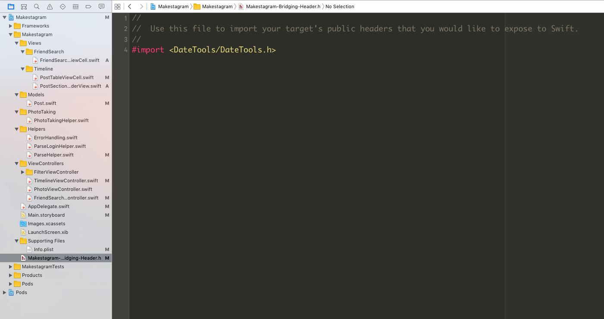

Earlier in this project, we mentioned _CocoaPods_ as a great way to manage your external libraries. Now, we are going to show you how to find these libraries, and we are going to add one to power the _humanized_ time display in our timeline.

#Installing a Library

For the feature we want to implement - displaying the amount of time that has passed since a post was created - we want to use the _DateTools_ library.
It will help us to convert time spans into human readable strings.

Now how do you find such a library on your own? **Google!** For example _"Date time since iOS library"_. In many cases your search terms will lead you to a GitHub page as shown below:

That GitHub page will typically contain the name _CocoaPod_ of the library, which allows you to add it your _Podfile_. Also, the [CocoaPods](https://cocoapods.org) website, lets you search for libraries.

> [action]
> Add the _DateTools_ dependency to your _Podfile_ so that it looks like this:
>
    # Uncomment this line to define a global platform for your project
    platform :ios, '9.0'
    # Uncomment this line if you're using Swift
    use_frameworks!
>
    target 'Makestagram' do
      pod 'Bond', '4.0.0'
      pod 'DateTools'
      pod 'ConvenienceKit'
      pod 'Parse'
      pod 'ParseFacebookUtilsV4'
      pod 'ParseUI'
    end
>
    target 'MakestagramTests' do
>
    end

> Then **close** your Xcode project, return to the command line and run:
>
    pod install

Now your dependencies will be download and installed.

> [action]
>  Re-open the **workspace** that _CocoaPods_ has generated:
> 

#Importing the Library

If you have installed a Swift library, you can import it with the regular, well known `import` statement in any of your Swift files, e.g.:

    import MyLibrary

However, most of the Libraries that you will use will be written in Objective-C, Apple's original language for iOS. These libraries need to be imported a little bit differently.

To import Objective-C libraries, you need to add them to a _Bridging Header_. Our template project already comes with such a bridging header, so let's add the _DateTools_ library to it.

> [action]
> Add the _DateTools_ library to _Makestagram's_ bridging header as shown below:

#Using the Library

Now we can finally use the Library to display how long ago a post has been created!
Let's extend the `PostSectionHeaderView` to use the new library.

> [action]
> Extend the `didSet` observer of the `post` property in the `PostSectionHeaderView` as following:
>
    var post: Post? {
      didSet {
        if let post = post {
          usernameLabel.text = post.user?.username
          // 1
          postTimeLabel.text = post.createdAt?.shortTimeAgoSinceDate(NSDate()) ?? ""
        }
      }
    }

1. We are reading the `createdAt` date from the `post`. This is a property that Parse sets by default on all `PFObjects`. Then we use an extension provided by the _DateTools_ library: `shortTimeAgoSinceDate(_:)`. This method takes a comparison date. By calling `NSDate()` we create a date object with the current time. If the post has been created 4 hours ago, this line of code will generate the string _"4h"_. Since `createdAt?` is an optional, we use the `??` operator to fall back to an empty string, in case the 'createdAt' date should be nil.

Awesome! Now it's once again time to test this new feature. When running the app you should now see that the header cells display how long ago a post has been created:

#Conclusion

In this step you have learned how to leverage the power of open source software in your project. There couldn't be a better way to end this _Makestagram_ tutorial!

Now it's time to take everything you have learned and build your very own app! And always remember: some developer might already have solved your problem for you. The answers are at your fingertips!
